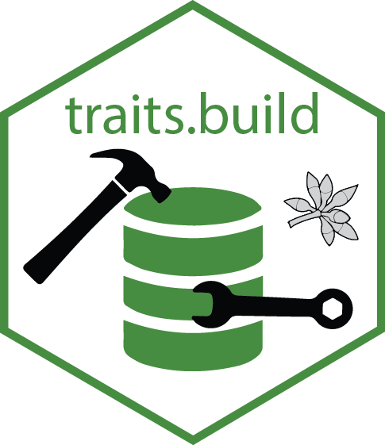

# The {traits.build} R package 

<!-- badges: start -->

<!-- badges: end -->

Imagine you wanted to build a database of traits. You might start by compiling data from existing datasets, but you'd quickly find that there are many ways to name and measure the same trait, that different studies use different units, or use an outdated name for a species or taxon.

The `traits.build` package provides a workflow for harmonising data from 
disconnected primary sources and arises from the AusTraits project [austraits.org](https://austraits.org). In 2023 this package was spun out as a separate package from the [`autraits.build`](http://traitecoevo.github.io/austraits.build/) repository.

## Goals

The goals of this package are to:

1.  Enable users to create open-source, harmonised, reproducible databases from disparate datasets.
2.  Provide a fully transparent workflow, where all decisions on how the data are handled are exposed.
3.  Offer a relational database structure that fully documents the contextual data essential to interpreting ecological data.
4.  Offer a straightforward, robust template for building a trait dictionary.
5.  Offer a database structure that is flexible enough to accommodate the complexities inherent to ecological data.
6.  Offer a database structure that is underlain by a documented ontology, ensuring each database field is interpretable and interoperable with other databases and data structures.
7.  Have no dependencies on proprietary software or costs to setup and maintain (beyond person time).

To handle the harmonising of diverse data sources, we use a reproducible
workflow to implement the various changes required for each source to
reformat it suitable for incorporation in a harmonised compilation. Such changes include restructuring datasets, renaming variables, changing variable
units, changing taxon names.

## Prerequisites

1. Familiarity with the [R programming language](https://www.r-project.org/), covered in [R for Data Science](https://r4ds.had.co.nz/).
2. [Data science workflow management techniques](https://rstats.wtf/index.html).
3. [How to write functions](https://r4ds.had.co.nz/functions.html) to prepare data, analyse data, and summarise results in a data analysis project.
4. [Appreciation of `traits.build`` workflow](https://traitecoevo.github.io/traits.build-book/), including the required file structure.

## Installation 

There are multiple ways to install the `traits.build` package itself, and both the latest release and the development version are available.

| Type        | Source   | Command                                                           |
|-------------|----------|-------------------------------------------------------------------|
| Release     | CRAN     | *not yet on CRAN — install the development version from GitHub* |
| Development | GitHub   | `remotes::install_github("traitecoevo/traits.build")`                     |

## Documentation

- [User manual](https://traitecoevo.github.io/traits.build-book/): in-depth
  discussion about how to use `traits.build`.
- [Reference website](http://traitecoevo.github.io/traits.build/): formal
  documentation of all user-side functions.

## Tutorials

- [Example compilation](https://traitecoevo.github.io/traits.build-book/tutorial_compilation.html)
- [Adding datasets](https://traitecoevo.github.io/traits.build-book/tutorial_datasets.html)

## Help

Please read the [help guide](https://traitecoevo.github.io/traits.build-book/help.html) to learn how best to ask for help using `traits.build`.

## Code of conduct

* Please note that the package follows the [Contributor Code of Conduct for the AusTraits projects](http://traitecoevo.github.io/austraits.build/CODE_OF_CONDUCT.html). By contributing to this project you agree to abide by its terms.

## Citation

A publication describing the `traits.build` workflow:
> Wenk E, Bal P, Coleman D, Gallagher R, Yang S, Falster D (2024) traits.build: A data model, workflow and R package for building harmonised ecological trait databases. *Ecological Informatics* 83: 102773. DOI: [10.1016/j.ecoinf.2024.102773](https://doi.org/10.1016/j.ecoinf.2024.102773)

A publication describing the biggest database using the `traits.build` workflow:

> Falster D, Gallagher R, Wenk, E et al. (2021) AusTraits, a curated plant trait 
database for the Australian flora. Scientific Data 8: 254. 
DOI: [10.1038/s41597-021-01006-6](http://doi.org/10.1038/s41597-021-01006-6)

## AusTraits family

`traits.build` is part of the **AusTraits family** of packages maintained by the
[AusTraits](https://austraits.org) team. See **[austraits.org](https://austraits.org)** for the
project, the data, and the people behind it.

Contributing? Issues across the family are tracked on one board,
[AusTraits #9](https://github.com/orgs/traitecoevo/projects/9), and new issues are auto-added. Please
read the [issue & labelling guide](https://github.com/traitecoevo/austraits-meta/blob/main/governance/issue-guide.md)
in [`austraits-meta`](https://github.com/traitecoevo/austraits-meta) — the family's cross-package
knowledge and governance hub — before filing.

## Acknowledgements

AusTraits is made possible by contributions from our partner organisations — the
[University of New South Wales](https://www.unsw.edu.au/),
[Western Sydney University](https://www.westernsydney.edu.au/),
[Botanic Gardens of Sydney](https://www.botanicgardens.org.au/),
[the University of Melbourne](https://www.unimelb.edu.au/),
the [Atlas of Living Australia](https://www.ala.org.au/), and the Australian Government
[Department of Climate Change, Energy, the Environment and Water](https://www.dcceew.gov.au) — and
from our [advisory board, data contributors, and past partners](https://austraits.org/team/team-partners.html).

AusTraits is a co-investment partnership with the
[Australian Research Data Commons](https://ardc.edu.au/) (ARDC) through the Planet Research Data
Commons ([DOI: 10.3565/nyk4-4r91](https://doi.org/10.3565/nyk4-4r91)). The ARDC is enabled by the
Australian Government's [National Collaborative Research Infrastructure Strategy](https://www.education.gov.au/ncris)
(NCRIS).

This work received investment ([DP720](https://doi.org/10.47486/DP720)) from the ARDC.

## AusTraits family

`traits.build` is part of the **AusTraits family** of packages maintained by the
[AusTraits](https://austraits.org) team. See **[austraits.org](https://austraits.org)** for the
project, the data, and the people behind it.

Contributing? Issues across the family are tracked on one board,
[AusTraits #9](https://github.com/orgs/traitecoevo/projects/9), and new issues are auto-added. Please
read the [issue & labelling guide](https://github.com/traitecoevo/austraits-meta/blob/main/governance/issue-guide.md)
in [`austraits-meta`](https://github.com/traitecoevo/austraits-meta) — the family's cross-package
knowledge and governance hub — before filing.
